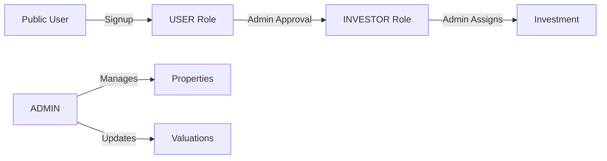
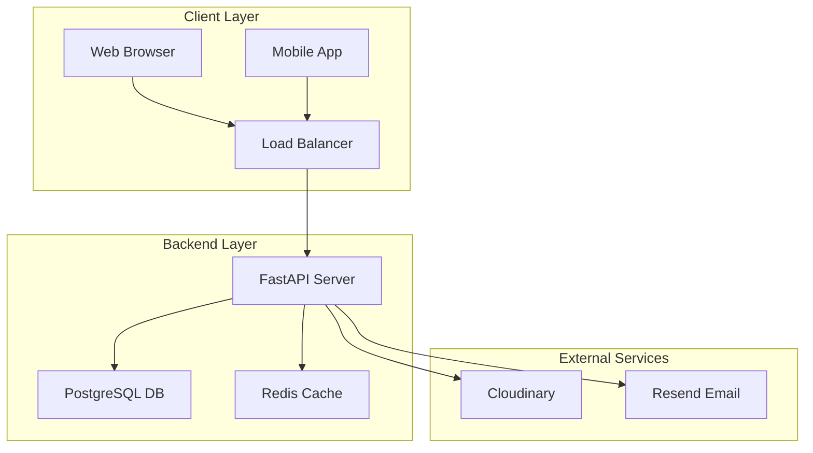

# 🏘️ Plug of Lagos Property - Backend API

A production-ready FastAPI backend for a real estate investment platform with role-based access control, admin-managed investor assignments, and property valuation tracking.

## 📋 Table of Contents

- [Overview](#overview)
- [Architecture](#architecture)
- [Features](#features)
- [Tech Stack](#tech-stack)
- [Getting Started](#getting-started)
- [API Documentation](#api-documentation)
- [Database Schema](#database-schema)
- [Testing](#testing)
- [Deployment](#deployment)
- [Media Upload Guide](#media-upload-guide-frontend)

---

## 🎯 Overview

The Plug of Lagos Property platform enables:

- **Public Access**: Browse available properties and updates
- **User Signup**: Anyone can create an account
- **Admin Control**: Admins promote users to investors and assign investments
- **Investor Dashboard**: Track portfolio growth and valuations

### Key Business Logic



---

## 🏗️ Architecture

### System Architecture



---

## 🚀 Features

### 🔐 Authentication & Roles
- **JWT Auth**: Secure access with access/refresh tokens
- **Role-Based Access Control (RBAC)**:
  - `USER`: Default role, can browse and wishlist
  - `INVESTOR`: Can view portfolio and financial data
  - `ADMIN`: Full system control

### 🏠 Property Management
- Admin creates and updates property listings
- Image gallery support (via Cloudinary)
- Investment status tracking (Available, Sold Out)

### 💰 Investment Portfolio
- **Manual Assignment**: Admin assigns investments to investors (offline payment verification)
- **Valuation Updates**: Admin updates property values; investors see real-time ROI
- **Financial Metrics**: Track initial investment, current value, and growth percentage

### 📰 Updates & News
- Admin posts property-specific updates or general news
- Investors get notified of updates for their properties

---

## 🛠️ Tech Stack

- **Framework**: FastAPI (Python 3.10+)
- **Database**: PostgreSQL 15
- **ORM**: SQLAlchemy 2.0 (Async)
- **Migrations**: Alembic
- **Caching**: Redis
- **Authentication**: OAuth2 with Password Flow (JWT)
- **Validation**: Pydantic v2
- **Media**: Cloudinary
- **Email**: Resend
- **Containerization**: Docker & Docker Compose

---

## 🏁 Getting Started

### Prerequisites
- Docker & Docker Compose
- Python 3.10+ (for local dev)

### 1. Clone & Configure
```bash
git clone <repo-url>
cd property-backend
cp .env.example .env
# Edit .env with your credentials
```

### 2. Run with Docker (Recommended)
```bash
docker-compose up --build -d
```
Access the API at `http://localhost:8000`  
Docs at `http://localhost:8000/docs`

### 3. Run Locally
```bash
# Create venv
python -m venv venv
source venv/bin/activate  # or venv\Scripts\activate on Windows

# Install deps
pip install -r requirements.txt

# Start services (DB/Redis)
docker-compose up -d db redis

# Run migrations
alembic upgrade head

# Start app
uvicorn app.main:app --reload
```

---

## 📚 API Documentation

Interactive Swagger documentation is available at `/docs`.

### Key Endpoints

| Method | Endpoint | Description | Role |
|--------|----------|-------------|------|
| POST | `/api/auth/signup` | Register new user | Public |
| POST | `/api/auth/login` | Get access token | Public |
| GET | `/api/properties` | List properties | Public |
| GET | `/api/investor/portfolio` | Get my investments | Investor |
| POST | `/api/admin/investments` | Assign investment | Admin |
| PATCH | `/api/admin/investments/{id}/valuation` | Update value | Admin |


---

## 🗄️ Database Schema

### Users
- `id`: Integer (PK)
- `email`: String (Unique)
- `role`: Enum (USER, INVESTOR, ADMIN)

### Properties
- `id`: Integer (PK)
- `title`: String
- `status`: Enum (AVAILABLE, SOLD, INVESTED)
- `image_urls`: Array[String]

### Investments
- `id`: Integer (PK)
- `user_id`: FK -> Users
- `property_id`: FK -> Properties
- `initial_value`: Float (Purchase price)
- `current_value`: Float (Updated by Admin)
- `growth_amount`: Computed (Current - Initial)

---

## 🧪 Testing

Run tests with `pytest`:

```bash
# Run all tests
pytest

# Run with verbose output
pytest -v
```

---

## 🚢 Deployment

The app is containerized and ready for deployment on any Docker-compatible host (AWS ECS, DigitalOcean App Platform, Railway, etc.).

1. **Build Image**: `docker build -t property-backend .`
2. **Run Container**: Pass all `.env` variables to the container.
